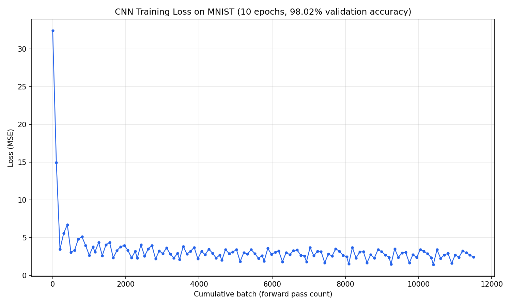

# A From-Scratch C++ Tensor Autograd Engine (with N-Dimensional Broadcasting and a Trained CNN)

A tensor library and automatic differentiation engine built entirely from scratch in C++. Supports N-dimensional tensor operations, broadcasting, and a full computation graph with reverse-mode automatic differentiation (backpropagation). Includes a trained multi-layer perceptron and a trained convolutional neural network, both evaluated on MNIST handwritten digit data.

This project started as a scalar autograd engine, and was extended into a full N-dimensional tensor engine with broadcasting, matrix multiplication, and 2D convolution support.

## Results

| Model | Architecture | Validation Accuracy |
| :---- | :---- | :---- |
| MLP | 784 → 128 → 64 → 10 | 97.34% |
| CNN | 2 conv layers (4, 8 filters) + maxpool + MLP | 98.02% |

Both trained on 37,000 MNIST images, validated on 5,000 images, using a from-scratch training loop (forward pass, MSE loss, backpropagation, stochastic gradient descent).

Training curve (CNN, 10 epochs):


Raw training log:
See [results/training_log.txt](http://results/training_log.txt) for the complete, unedited output of the final training run.

## Features:

**Core tensor engine (`Tensor.hpp`)**

- Arbitrary-rank tensors
- Full NumPy-style broadcasting (including simultaneous broadcasting, (e.g. (1,3) + (3,1)))
- Reverse-mode automatic differentiation via topological sort + reverse traversal of the computation graph
- Reference-counted memory management via `shared_ptr` and `enable_shared_from_this`, no manual memory management

**Operations, each with hand-derived forward and backward passes:**

- `add`, `mul` — elementwise, with full broadcasting support
- `relu` — nonlinearity
- `matmul` — batched matrix multiplication with broadcast-compatible batch dimensions
- `conv2d` — 2D convolution, multi-filter, multi-channel
- `maxpool2d` — max pooling
- `sum, reshape` — reduction and shape manipulation

**Model code**

- `Layer` / `MLP (Neural_Network_Tensor.hpp)` — fully-connected layers built on `matmul`
- `ConvLayer / CNN (Conv_Layer.hpp)` — convolutional layers chained into a two-stage CNN feeding into an MLP head
- `MNIST_Data (CSV_Parser.hpp)` — CSV parsing and batching for the Kaggle MNIST dataset

## Architecture

Every tensor operation follows the same pattern: compute the output shape, walk every position in the output using stride-based offset arithmetic (generalized to arbitrary rank via an odometer-style index increment), walk the inputs performing the same stride-based arithmetic, and attach a `backward_fn` closure that computes gradients using the exact same offset logic in reverse. For each input value, sum the contributions from every place it was used during the forward pass, weighted by the upstream gradient.

This pattern is what makes the engine's more complex operations (batched `matmul`, multi-channel `conv2d`) tractable: extending an operation to a new axis (e.g. adding a batch dimension, or a channel dimension) is a matter of extending the offset formula by one term, not rewriting the operation.

## Notable challenges and bugs

**Dead ReLU on the output layer.** Early in training, applying ReLU to the MLP's final output layer caused one output neuron's pre-activation to go negative, get set to zero, and receive zero gradient. Since ReLU's derivative is exactly zero for negative inputs, no weight update could ever recover it. Loss got permanently stuck. Fixed by not applying ReLU to the final layer, which should produce unconstrained output scores rather than a clamped, non-negative activation.

**Weight initialization instability.** Using a fixed [-1, 1] uniform range for weight initialization caused activations to grow with sqrt(n) as layer width increased (a consequence of summing `n` independent random terms), leading to exploding loss (10^6 → 10^245 within 200 batches) once trained on real, wide (784-input) data. Fixed by scaling the initialization range by 1/sqrt(n_in) per layer, keeping activation magnitude ~1.0 regardless of layer width.

**A shared_ptr self-reference cycle.** After converting the engine from raw pointers to `shared_ptr` (to eliminate an unbounded memory leak, discovered when a full CNN training run hit `std::bad_alloc`), every tensor's `backward_fn` closure captured the tensor's own output (`out`) by `shared_ptr`. Since `out->backward_fn` is a member of `out` itself, and the closure held a strong reference back to `out`, every tensor was keeping itself permanently alive, a self-reference cycle that reproduced the original leak despite `shared_ptr`'s reference counting. Diagnosed via layer-by-layer isolation testing (`Tensor` core → `Layer` → `ConvLayer` → full `CNN`) to confirm each layer's correctness in turn. Fixed by capturing a raw, non-owning pointer (`out.get()`) inside each closure instead of the owning `shared_ptr`, relying on `backward()`'s own topological-order traversal to guarantee each tensor is still alive whenever its `backward_fn` actually runs.

## Design notes / known limitations

- `conv2d` currently uses a naive, unvectorized sliding-window implementation with individually indexed scalar operations.
- Intermediate tensors are not manually freed mid-training-loop; reliance is entirely on `shared_ptr` reference counting.
- The scalar engine in `/scalar-engine` is kept as a record of the project's starting point and is not used by the tensor engine.

## Building and running

```
g++ -O2 -std=c++17 main.cpp -o main.exe
./main.exe
```

Data source:
MNIST data (`mnist_train.csv, mnist_val.csv`) is sourced from Kaggle's [Digit Recognizer competition](https://www.kaggle.com/competitions/digit-recognizer) and split locally into training/validation sets (not included in this repo, see `.gitignore`).

## File structure

Tensor.hpp — core tensor engine (ops, autograd, broadcasting)

Neural_Network_Tensor.hpp — Layer / MLP

Conv_Layer.hpp — ConvLayer / CNN

CSV_Parser.hpp — MNIST data loading

main.cpp — training loop, loss function, entry point

scalar-engine/ — earlier scalar (non-tensor) autograd engine

results/ — training log and loss curve from the final run
